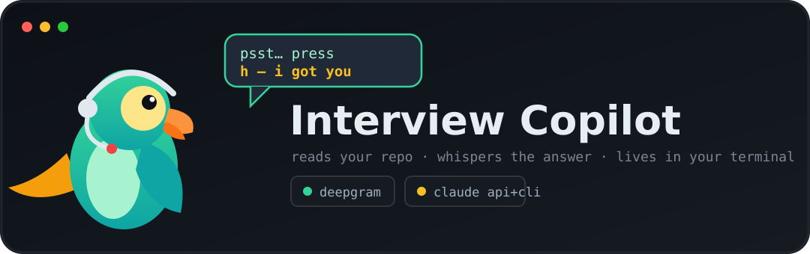
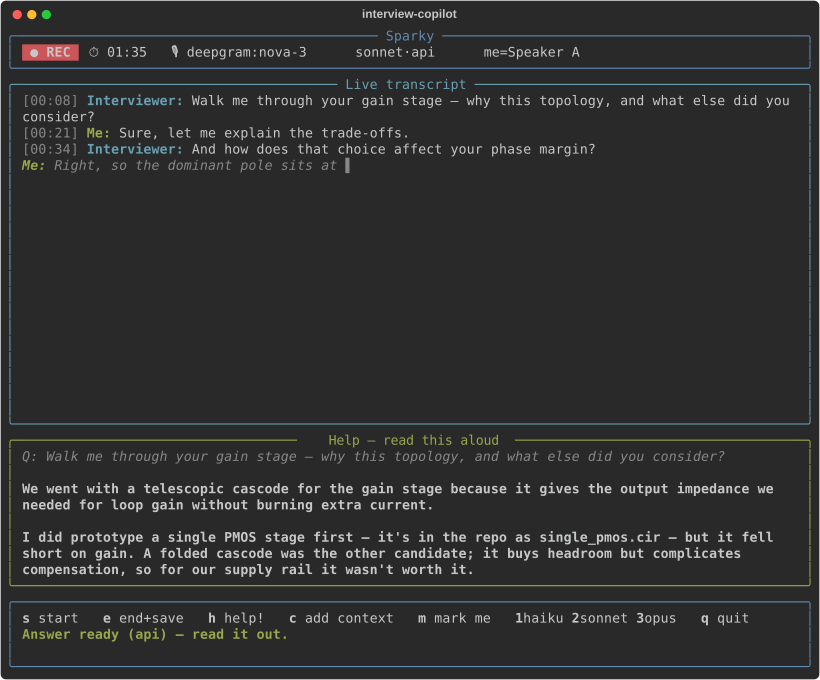

<p align="center">
  
</p>

<p align="center">
  <b>Sparky</b> is a terminal copilot for in-person technical interviews. Launch it inside your
  project, it transcribes the room live, and on a keypress drafts a
  <b>first-person answer</b> to the latest question — grounded in <i>your</i>
  codebase — for you to read aloud.
</p>

<p align="center">
  
</p>

---

## Setup

**Requirements:** `ffmpeg`, Python >= 3.10, and the `claude` CLI (logged in).
Optional keys make it faster; both have automatic fallbacks if absent:

```bash
git clone <your-repo-url> && cd interview-copilot
./install.sh           # creates a venv + installs `interview-copilot` on your PATH
```

> **No keys required.** Without them the app still runs — local Whisper for
> transcription and the `claude` CLI for answers. Keys only make it faster, and
> each **falls back automatically** (even mid-interview) if it is missing or fails.

Optionally add keys to `~/.config/interview-copilot/config.env` (chmod 600) for speed:

```ini
DEEPGRAM_API_KEY=...    # Faster streaming transcription.  Absent -> local Whisper.
ANTHROPIC_API_KEY=...   # Faster answers (~1s).            Absent / on failure -> claude CLI.
```

### Offline operation (no Wi-Fi)

A live **`● online` / `● OFFLINE`** marker sits in the header, and the app
**switches automatically mid-session** if the network drops:

| | Online | Offline (no Wi-Fi) |
|---|---|---|
| **Transcription** | Deepgram (or local Whisper) | **local Whisper** — works out of the box |
| **Answers** | Claude API -> CLI | **local LLM** via Ollama |

Transcription is fully offline already. For **offline answers**, install a local
LLM once, while you still have internet:

```bash
curl -fsSL https://ollama.com/install.sh | sh   # one-time
ollama pull qwen3:4b-instruct-2507-q4_K_M       # ~2.5 GB — the default local model
```

Qwen3 4B Instruct (2507) is the default: a non-thinking text instruct model that
answers immediately, so it stays near-real-time even on a CPU-only machine. To use
a different local model, pull it and pass `--ollama-model <ollama-tag>` (for
example `--ollama-model qwen3.5:4b` or `--ollama-model qwen3:8b-instruct`).

If Wi-Fi drops mid-interview, transcription and answers both switch to local
automatically and the header flips to `● OFFLINE`. Run `interview-copilot --self-test`
to check whether offline answers are ready.

Verify the full setup:

```bash
interview-copilot --self-test
```

## Usage

```bash
cd ~/your/project
interview-copilot
```

| Key | Action |
|-----|--------|
| `s` / `e` | **Start** / **End and save** the interview (writes `interview-*.md` here) |
| `h` | **Help** — draft a first-person answer to the latest question |
| `c` | Type extra context to steer the next answer |
| `m` | Mark which detected speaker is **you** |
| `1` `2` `3` | Switch answer model: haiku / sonnet / opus |
| `↑` `↓` | Scroll a long answer; `q` to quit |

## Features

- **Near-real-time transcription** — Deepgram streaming, with automatic fallback to local Whisper if it drops.
- **Answers grounded in your repository** — reads the directory's README, manifests, and file tree; Claude **API -> CLI -> local LLM** fallback.
- **Offline operation** — switches to local Whisper and a local LLM when Wi-Fi drops, with a live `● online / ● OFFLINE` marker.
- **Best-effort speaker separation** — distinguishes you from the interviewer, or falls back to a plain transcript.
- **Resilient and visible** — the header always shows the live backend and tags any mid-session `(fallback)`.
- **Session transcript** — saves a Markdown transcript on stop; fully keypress-driven; long answers scroll.

## Browser version (Google Meet / Teams)

A **visible** Chrome side-panel build lives in [`extension/`](extension/). It
transcribes a Meet or Teams call and drafts talking points in a panel, using the
same Deepgram + Claude stack. It is a normal, on-screen aid (no stealth or
screen-share hiding) — use it where you have consent. See
[`extension/README.md`](extension/README.md) for loading instructions.

## How it works

```
  mic / room audio
       │ (ffmpeg)
       ▼
  transcription ── Deepgram streaming
       │            └─ no key / drop → local Whisper
       ▼
  live transcript + your repo's context + latest question
       │
       ▼
  Claude ── API (fast)
       │     ├─ no key / failure → claude CLI
       │     └─ offline         → local LLM (Ollama)
       ▼
  first-person answer ─▶ you read it aloud
       │
       ▼
  interview-*.md (saved when you stop)
```

Audio capture only *forwards* bytes; transcription and answer-drafting run off the
capture loop, so the UI never blocks. Run the test suite with
`.venv/bin/python -m pytest`.

> Intended as a confidence aid and preparation tool. Cloud transcription streams
> audio to Deepgram; run `--stt local` to keep everything on-device.
