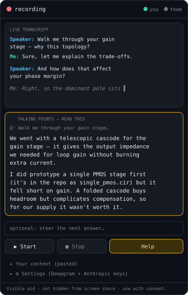

# Sparky — Chrome extension

<p align="center"></p>

A browser version of the desktop copilot for **Google Meet and Microsoft Teams**
(web). It transcribes the call's audio live and, on a click, drafts
context-grounded **talking points** in a Chrome **side panel** you can read.

It is a **visible aid** — it lives in the normal side panel and is **not hidden
from screen sharing**. There is deliberately no stealth or anti-capture mode.
Use it where you have consent to transcribe the call, and disclose it where
required (interview accommodations, etc.).

## Setup

1. **Load the extension** (unpacked):
   - Open `chrome://extensions` and turn on **Developer mode** (top right).
   - Click **Load unpacked** and select this `extension/` folder.
2. **Add your keys** — click the toolbar icon to open the side panel, expand
   **Settings**, and paste:
   - **Deepgram API key** — streaming transcription.
   - **Anthropic API key** — drafts the answers. *(Stored in `chrome.storage.local`
     on your machine. A client-side key is fine for personal use but is visible
     to anything with access to your profile — do not ship this key elsewhere.)*
3. Optionally paste your **context** (résumé, project summary, job description)
   so answers are grounded in it, and pick an answer model.

## Usage

1. Open your Meet or Teams call in a tab and **focus that tab**.
2. Click the extension icon; the side panel opens. Accept the consent notice.
3. Press **Start**. The first time, Chrome asks for **microphone** access (grant
   it). It then captures two sources and the transcript fills in live (you still
   hear the call normally).
4. **Speakers are detected automatically.** Your **mic** is always **Me**. The
   call's audio is split by Deepgram diarization, so several people on the far
   end become **Interviewer 1**, **Interviewer 2**, **Interviewer 3** (a call
   with one other voice just reads **Interviewer**). No manual marking. The
   `you` / `them` dots in the header light up when each side is being heard, so
   you can confirm capture.
5. Press **Help** at any time to draft a first-person answer to the interviewer's
   latest question.
6. Press **Stop** when done. The call is saved to **History** automatically.

## History

Every call is written to `chrome.storage.local` **as it happens**, not at Stop, so
closing the side panel mid-call or forgetting to press Stop does not lose the
transcript. Open **History** in the panel to get the last 50 calls, newest first
(older ones are pruned automatically).

Each entry is named for you: the title is the first question asked of you,
quoted, plus the call app (`"Tell me about yourself." - Meet`). If an Anthropic
key is set, Stop then upgrades that to a one-line summary of what the call was
actually about, using haiku. A failed or absent title call just leaves the quote.

Per entry you can:

- **click the title** to read the whole transcript inline, labelled and coloured
  per voice exactly as it was live
- **Copy** it as labelled plain text
- **Download** it as Markdown to `Downloads/sparky/YYYY-MM-DD-<title>.md`
- **Rename** it (Enter saves, Escape cancels)
- **Delete** it, or **Clear all**

Delete and Clear all arm on the first click and fire on the second, and nothing
leaves your machine: transcripts sit in the extension's own local storage, which
is why deleting a call you would rather not keep is one click away.

## Troubleshooting — "I don't see any transcript"

Text only appears when **someone actually speaks** into a captured source. While
recording with no text yet, the panel tells you exactly what it is hearing:

- **`them … waiting for the call tab`** — the meeting tab is not producing audio.
  Make sure the **call tab** (the one you focused when pressing Start) actually
  has sound playing. If you are alone in the call, there is nothing to transcribe.
- **`mic off`** — Chrome **does not show the mic prompt inside a side
  panel**, so the request is auto-denied and there is no microphone icon to
  click. Press the **Fix microphone access** button that appears under
  Start/Stop: it opens a normal tab where the prompt *does* render. Click
  **Allow** there, close the tab, then press **Fix microphone access** once
  more. The grant is keyed to the extension, so the side panel inherits it, and
  the mic binds to the recording already in progress (no Stop/Start round trip,
  and nothing already transcribed is lost). Until that succeeds your own voice
  has no channel of its own, which is why it can end up attributed to the call.

**Definitive 30-second self-test (no call needed):** open any tab playing speech
— for example a talking **YouTube** video — focus that tab, open the side panel,
press **Start**, then switch back to the video. Within a second or two you will
see **`Interviewer:`** lines fill in. That confirms the capture -> Deepgram ->
display path end-to-end. (Run `node extension/test_render.cjs` to verify the
rendering path in code.)

## How it works

```
  your mic ──────────────────→ Deepgram ──────────→ "Me"           ┐
  meeting tab (tabCapture) ───→ Deepgram (diarize) ─→ "Interviewer N" ┘─→ live transcript
                                                                  │
   your context + transcript + the interviewer's question ────────┼─→ Anthropic API
                                                                  ↓
                                            talking points in the side panel
```

- Cloud-only by nature (a browser cannot run local Whisper or a local LLM the way
  the desktop app does), so it needs internet and both API keys.
- Auth quirks handled: Deepgram over the browser WebSocket uses the
  `["token", key]` subprotocol; Anthropic uses the
  `anthropic-dangerous-direct-browser-access` header.

## Limitations

- **Not invisible to screen share** — by design. If you share your screen, this
  panel is part of your screen. The honest path for a real need (for example
  anxiety or accessibility) is disclosure or an accommodation, not concealment.
- Captures **two sources**: your microphone (-> "Me") and the meeting tab's audio
  (-> "Interviewer N"). Which *side* you are on is exact, because it comes from
  the capture source rather than a guess. Telling the far-end voices apart is
  Deepgram diarization, so it is good but not infallible: voice indices can drift
  on heavy crosstalk, and the numbering restarts on each Start. The first Start
  needs mic permission.
- If you run on speakers rather than headphones, your mic also hears the call.
  Browser echo cancellation plus a text-level duplicate filter (a line arriving
  on both sources within a few seconds is dropped) keeps that out of the
  transcript. Short backchannels like "yes" are deliberately never filtered.
- Personal-use tool: keys live client-side; there is no server. Saved transcripts
  live in the same local storage, unencrypted — anything with access to your
  Chrome profile can read them.
